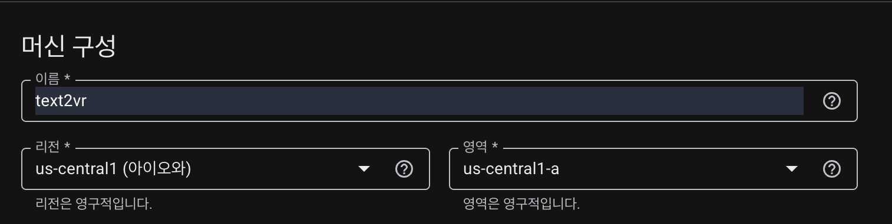
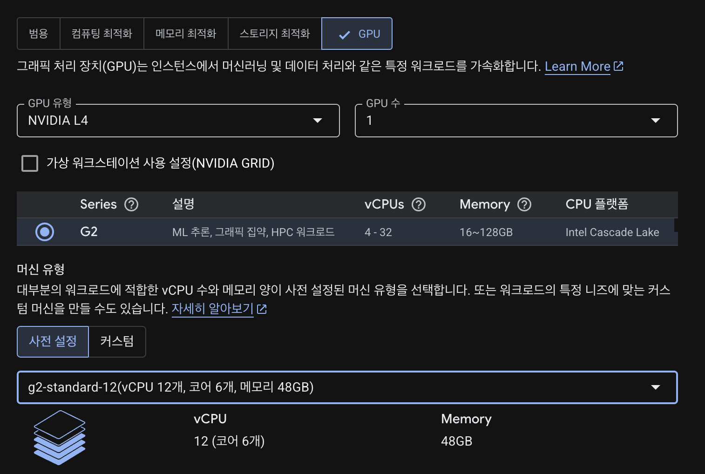
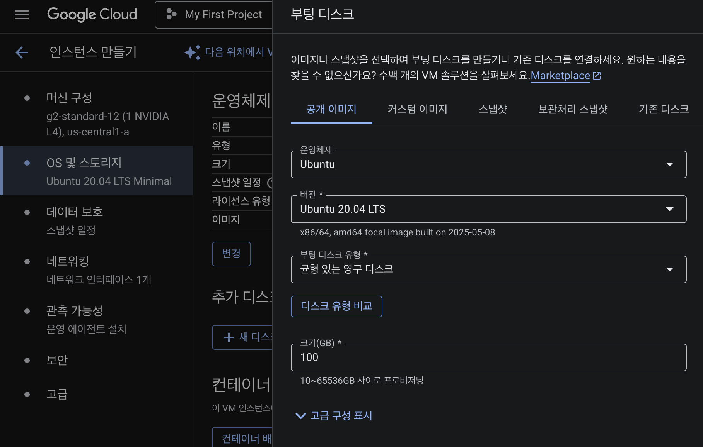
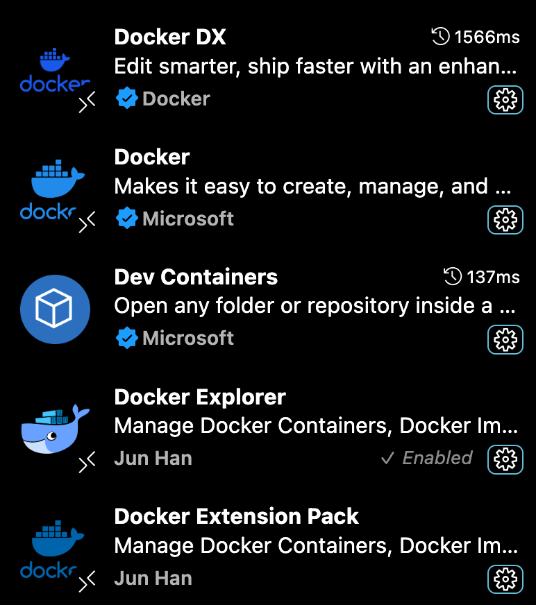
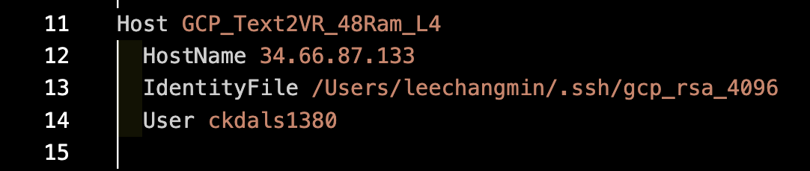

# ☁️ GCP 설정 가이드 (GPU 인스턴스용)

이 문서는 Google Cloud Platform(GCP)에서 GPU 인스턴스를 생성하고, SSH 및 할당량을 설정하는 모든 과정을 안내합니다.
> [GCP에서 GPU 사용하는 방법](https://jonhyuk0922.tistory.com/241) 알려주는 블로그 참고.
---

## 📌 GCP 회원가입 및 결제 설정

1. [https://cloud.google.com](https://cloud.google.com) 에서 로그인
2. 결제 수단(VISA, MASTER 카드) 등록
3. 첫 가입 시 \$300 \~ \$400 크레딧 제공

---

## 📁 프로젝트 생성 및 Compute Engine API 설정

1. 상단 `My First Project` 클릭 → `새 프로젝트` 생성
2. 좌측 메뉴 → `Compute Engine` → API 사용 활성화 (최초 1회 필요)

---

## 🚀 GPU 할당량 증가 요청

1. 메뉴 → `IAM 및 관리자 > 할당량`
2. 검색창에 `GPU` → `GPUs (all regions)` 항목 선택
3. 우측 상단 `할당량 수정` 클릭 → 새 한도에 `1` 입력
4. 사유: `딥러닝 실습용 GPU 필요` 등 간단히 작성
5. 제출 후 수 분\~수 시간 내 이메일로 승인 여부 통보

---

## 🔧 VM 인스턴스 생성 (NVIDIA L4)

1. Compute Engine > VM 인스턴스 → `인스턴스 만들기`
2. 주요 설정:
### 🚀 프로젝트 환경 설정 업데이트 (2025-06-30)

GCP VM 인스턴스 생성을 위한 표준 사양을 아래와 같이 확정 및 업데이트합니다.

| 항목 (Item) | 기존 값 (Old Value) | 변경 후 값 (New Value) | 변경 사유 (비고) |
| :--- | :--- | :--- | :--- |
| **리전 (Region)** | 대충 싼 지역 | `asia-northeast3` (서울) | 팀 전체의 작업 속도 향상 및 데이터 전송 비용 최적화 |
| **부팅 디스크 이미지** | `Ubuntu 20.04 LTS` | `Deep Learning on Linux` (최신) | GPU 드라이버 및 AI 라이브러리 자동 설치로 개발 시간 단축 |
| **부팅 디스크 유형** | 미지정 | `SSD 영구 디스크` | OS 및 프로그램의 전반적인 반응 속도 향상 |
| **부팅 디스크 크기** | `100GB 이상` | `150 GB` | 초기 설정 크기를 명확하게 지정 (필요시 증설 가능) |

#### Deep Learning on Linux 설치시, 
***Debian11 + CUDA 12.4가 있는 옵션으로 하면 nvidia drvier, CUDA, Doocker, NVIDIA Container Toolkit 알아서 설치됨!!***
> *나머지 사양(머신 유형, GPU)은 기존 논의와 동일하게 유지.(12v CPU, 48GB RAM, ...)*

3. 생성 후 외부 IP 확인 → SSH 접속 or VS Code 연결 준비 완료

### 참고자료
1. region (탄소 뭐시기 있는 애들이 좀 더 쌈)

2. 머신 유형 (GPU)

3. 부팅 디스크

---

## 🔑 SSH 키 생성 및 메타데이터 등록 (로컬 PC)

```bash
ssh-keygen -t rsa -b 4096 -f ~/.ssh/gcp_rsa_4096 -C "your_email@example.com"
```

1. 공개키 (`~/.ssh/gcp_rsa_4096.pub`) 내용을 복사
2. GCP > Compute Engine > 메타데이터 > `SSH 키` 탭 → 붙여넣기

---

## 💻 VS Code에서 SSH 연결하기

1. 확장: `Remote - SSH`, `Docker` 설치
* **SSH**<br/>
<br/>
* **Docker**<br/>
<br/>

2. `~/.ssh/config` 설정
<!--<br/>-->
```ssh
Host gcp-vm
  HostName <EXTERNAL_IP>
  User ubuntu
  IdentityFile ~/.ssh/gcp_rsa_4096
```
* 외부 IP 주의
* IdentityFile 위치 주의
* User 주의

3. VS Code 명령 팔레트 (Cmd+Shift+P) → `Remote-SSH: Connect to Host` → `gcp-vm` 선택
